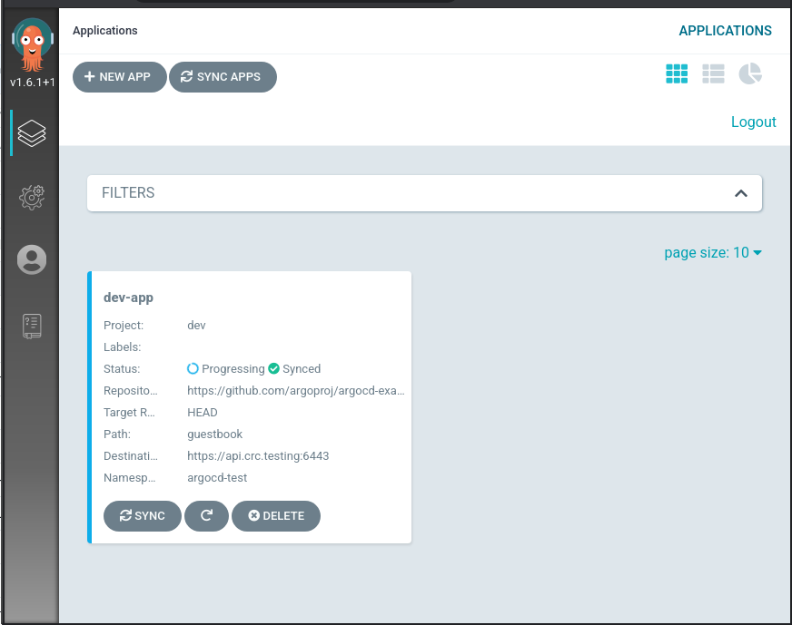

# Deployment on CRC

This is how to deploy ArgoCD on [CRC](https://developers.redhat.com/products/codeready-containers/overview).

## Installation Steps

 * Setup CRC https://developers.redhat.com/products/codeready-containers/overview
   * Do not forget to install the corresponding version of `oc` tool or some commands might fail.
   * add more memory to CRC : \
   `crc delete` \
   `crc config set memory 16384` \
   `crc start`

   * Consider adding [more disk space](./crc-disk-size.md) to your CRC.

* Use Toolbox to get the command line tools needed: https://github.com/containers/toolbox \
   `toolbox create --image quay.io/aicoe/of-toolbox:v0.1.0` \
   `toolbox enter --container of-toolbox-v0.1.0` \
   Then you have all the tools needed running in a separate container.

As an alternative you can install the prerequisites locally:
 * Get `kustomize` and KSOPS using steps in [manage_your_app_secrets.md](../manage_your_app_secrets.md)

 * Fork https://github.com/operate-first/continuous-deployment

 * Import GPG key that is used by kustomize to encrypt the secrets.\
   ```base64 -d < examples/key.asc | gpg --import ```

 * Proceed with [setup_argocd_dev_environment.md](../setup_argocd_dev_environment.md)

Your ArgoCD instance will be running at https://argocd-server-aicoe-argocd-dev.apps-crc.testing/. You can login as admin/admin.


