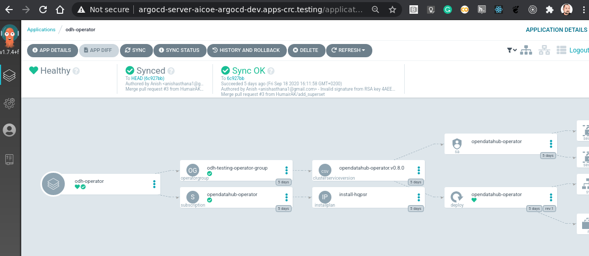
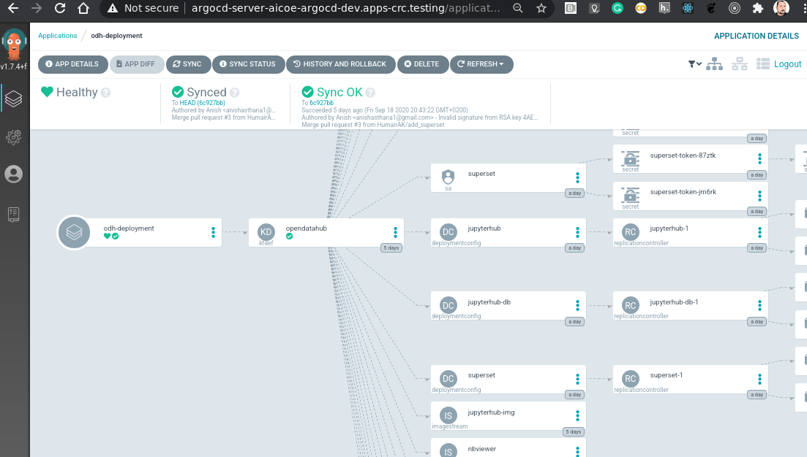

# Installing ODH using ArgoCD

## Preparation

First make sure that you have the OpenDataHub operator available in your OpenShift.

```bash
oc get packagemanifests -n openshift-marketplace | grep opendatahub-operator
```

If it's not present, then you need to troubleshoot the marketplace: https://github.com/operator-framework/operator-marketplace/issues/344

Then we need to create a projects named `odh-operator` and `opf-*`. (The name of the project is hard-coded in the `kustomize` files in https://github.com/operate-first/odh and you can change is there using `kustomize`.)

```bash
oc new-project odh-operator
oc new-project opf-{jupyterhub,superset}
```

Our ArgoCD SA `argocd-manager` needs to have access to the new project. On CRC I suggest giving `argocd-manager` access to all projects by creating a ClusterRoleBinding to a ClusterRole.

`oc apply -f examples/argocd-cluster-binding.yaml`

Then you need to change the `dev-cluster` to include all projects/namespace. (This is done by actually removing the value of `namespace`).

```bash
oc patch secret dev-cluster-spec -n aicoe-argocd-dev --type='json' -p="[{'op': 'replace', 'path': '/data/namespaces', 'value':''}]"
```

Be aware that if you change this value in the ArgoCD UI, you might loose the stored credentials for the cluster due to a bug in ArgoCD.

## Creating the ArgoCD applications

Now we can proceed with creating the ArgoCD Applications. We will create 2 applications:

1. The ODH operator. (Installs the ODH operator itself `odh-operator`.)
1. The ODH deployment. (Installs ODH components into `opf-*`.)

### Creating the ODH operator

You can create the Application resource from the command line using

```bash
oc apply -f examples/odh-operator-app.yaml
```

Or you can go to https://argocd-server-aicoe-argocd-dev.apps-crc.testing/applications and click "New App" and entering these values:

| Field            | Value                                      |
| ---------------- | ------------------------------------------ |
| Project:         | Default                                    |
| Cluster:         | dev-cluster (https://api.crc.testing.6443) |
| Namespace:       | odh-operator                               |
| Repo URL:        | https://github.com/operate-first/odh.git   |
| Target revision: | HEAD                                       |
| Path:            | operator/base                              |

This creates an app from definition in the repo under the path `odh-operator/base` and deploys it to the `odh-operator` namespace on the `dev-cluster`.

This app is all about deploying the Open Data Hub operator to your cluster.

Please note that the namespace is also hard-coded in the repo so changing it requires changing files in the repo.

Create the app and you will see Argo deploying resources:


### Creating the ODH deployment

Again, either from the command line:

```bash
oc apply -f examples/odh-deployment-app.yaml
```

or again going to https://argocd-server-aicoe-argocd-dev.apps-crc.testing/applications, clicking "New App" and entering these values:

| Field            | Value                                      |
| ---------------- | ------------------------------------------ |
| Project:         | Default                                    |
| Cluster:         | dev-cluster (https://api.crc.testing.6443) |
| Namespace:       | opf-jupyterhub                             |
| Repo URL:        | https://github.com/operate-first/odh.git   |
| Target revision: | HEAD                                       |
| Path:            | kfdef/jupyterhub                           |

| Field            | Value                                      |
| ---------------- | ------------------------------------------ |
| Project:         | Default                                    |
| Cluster:         | dev-cluster (https://api.crc.testing.6443) |
| Namespace:       | opf-superset                               |
| Repo URL:        | https://github.com/operate-first/odh.git   |
| Target revision: | HEAD                                       |
| Path:            | kfdef/superset                             |

This is about the actual deployment of Open Data Hub to your cluster.

Based on the content of `kfdef.yaml` (you will see components of ODH being created similar to:



You can find routes for your new ODH instance by running:

```bash
$ oc get routes -n opf-jupyterhub
NAME         HOST/PORT                                               PATH   SERVICES     PORT       TERMINATION     WILDCARD
jupyterhub   jupyterhub-opf-jupyterhub.apps-crc.testing          jupyterhub   8080-tcp   edge/Redirect   None

$ oc get routes -n opf-superset
NAME         HOST/PORT                                               PATH   SERVICES     PORT       TERMINATION     WILDCARD
superset     superset-opf-superset.apps-crc.testing              superset     8088-tcp                   None
```

To alter components deployed or anything else about the configuration fork https://github.com/operate-first/odh and replace references to this repo with your own fork.
