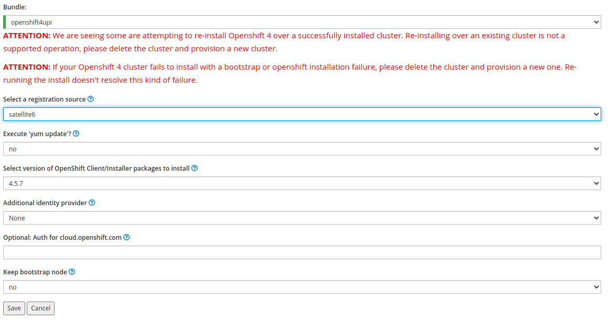
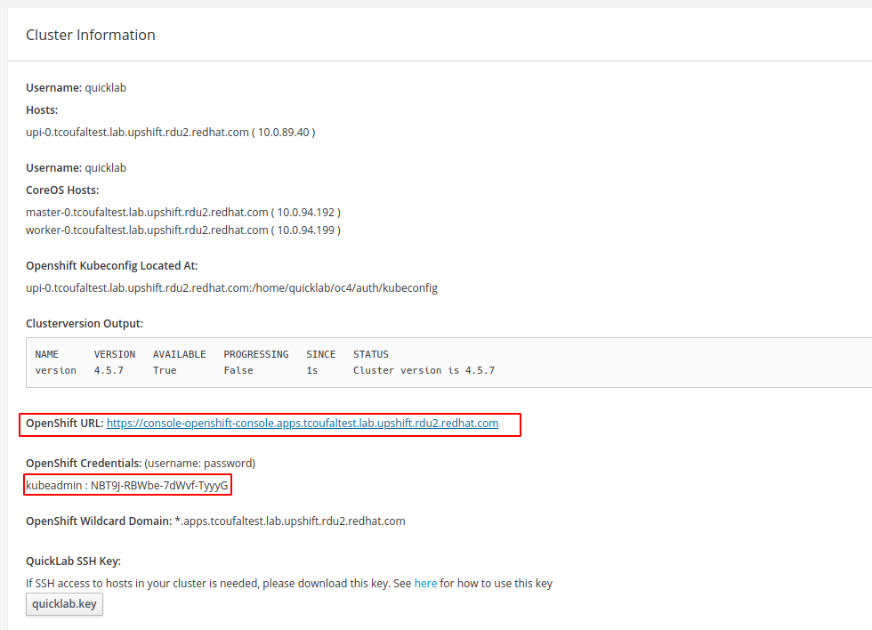

# Quicklab

## Set up a new Quicklab cluster

1. Go to [https://quicklab.upshift.redhat.com/](https://quicklab.upshift.redhat.com/) and log in (top right corner)

2. Click **New cluster**

3. Select **openshift4upi** template and a region you like the most, then select the reservation duration, the rest can be left as is:
   

4. Go to cluster page by clicking on the cluster name in **My clusters** table

5. Once the cluster reaches **Active** state your cluster history should look like this:
   

6. Now click on **New Bundle** button in **Product information** section

7. Select **openshift4upi** bundle. A new form loads - you can keep all the values as they are (you can ignore the warning on top as well, since this is the first install attempt of Openshift on that cluster):
   

8. Wait for OCP4 to install. After successful installation you should see a cluster history log like this:
   

9. Use the link and credentials from the **Cluster Information** section to access your cluster.
   

10. Login as the `kubeadmin`, take the value from "Hosts" and port 6443.\
    For example:

   ```sh
   oc login upi-0.tcoufaltest.lab.upshift.rdu2.redhat.com:6443
   ```

## Install Argo CD on your cluster

1. kube:admin is not supported in user api, therefore you have to create additional user. Simplest way is to deploy an Oauth via Htpasswd:

2. Create a htpasswd config file and deploy it to OpenShift:

   ```sh
   $ htpasswd -nb username password > oc.htpasswd
   $ oc create secret generic htpass-secret --from-file=htpasswd=oc.htpasswd -n openshift-config
   $ cat <<EOF | oc apply -f -
   apiVersion: config.openshift.io/v1
   kind: OAuth
   metadata:
     name: cluster
   spec:
     identityProviders:
     - name: my_htpasswd_provider
       mappingMethod: claim
       type: HTPasswd
       htpasswd:
         fileData:
           name: htpass-secret
   EOF
   ```

3. Grant the new user admin cluster-admin rights

   ```sh
   oc adm policy add-cluster-role-to-user cluster-admin username
   ```

4. Now log out and log in using the htpasswd provider (the new username). Generate new API token and login via this token on your local CLI

5. Now you can follow the upstream docs. Create the projects:
   ```sh
   oc new-project argocd-test
   oc new-project aicoe-argocd-dev
   ```

6. And deploy

   ```sh
   $ kustomize build manifests/crds --enable_alpha_plugins | oc apply -f -
   customresourcedefinition.apiextensions.k8s.io/applications.argoproj.io created
   customresourcedefinition.apiextensions.k8s.io/appprojects.argoproj.io created
   clusterrole.rbac.authorization.k8s.io/argocd-events-create-aggregate-to-admin created
   clusterrole.rbac.authorization.k8s.io/argocd-proj-apps-aggregate-to-admin created

   $ kustomize build manifests/overlays/dev --enable_alpha_plugins | oc apply -f -
   serviceaccount/argocd-application-controller created
   serviceaccount/argocd-dex-server created
   serviceaccount/argocd-manager created
   serviceaccount/argocd-server created
   role.rbac.authorization.k8s.io/argocd-application-controller created
   role.rbac.authorization.k8s.io/argocd-dex-server created
   role.rbac.authorization.k8s.io/argocd-server created
   clusterrole.rbac.authorization.k8s.io/argocd-manager-role created
   rolebinding.rbac.authorization.k8s.io/argocd-application-controller created
   rolebinding.rbac.authorization.k8s.io/argocd-dex-server created
   rolebinding.rbac.authorization.k8s.io/argocd-server created
   clusterrolebinding.rbac.authorization.k8s.io/argocd-manager-role-binding created
   configmap/argocd-cm created
   configmap/argocd-rbac-cm created
   configmap/argocd-ssh-known-hosts-cm created
   configmap/argocd-tls-certs-cm created
   secret/argocd-dex-server-oauth-token created
   secret/argocd-secret created
   secret/dev-cluster-spec created
   secret/ksops-pgp-key created
   service/argocd-dex-server created
   service/argocd-metrics created
   service/argocd-redis created
   service/argocd-repo-server created
   service/argocd-server created
   service/argocd-server-metrics created
   deployment.apps/argocd-application-controller created
   deployment.apps/argocd-dex-server created
   deployment.apps/argocd-redis created
   deployment.apps/argocd-repo-server created
   deployment.apps/argocd-server created
   appproject.argoproj.io/dev created
   application.argoproj.io/dev-app created
   route.route.openshift.io/argocd-metrics created
   route.route.openshift.io/argocd-server created
   route.route.openshift.io/argocd-server-metrics created

   $ examples/configure_development.sh
   serviceaccount/argocd-dex-server patched
   secret/argocd-secret patched
   configmap/argocd-cm replaced
   secret/dev-cluster-spec patched
   secret/dev-cluster-spec patched
   application.argoproj.io/dev-app replaced
   group.user.openshift.io/dev-group created
   group.user.openshift.io/dev-group added: "username"
   ```
