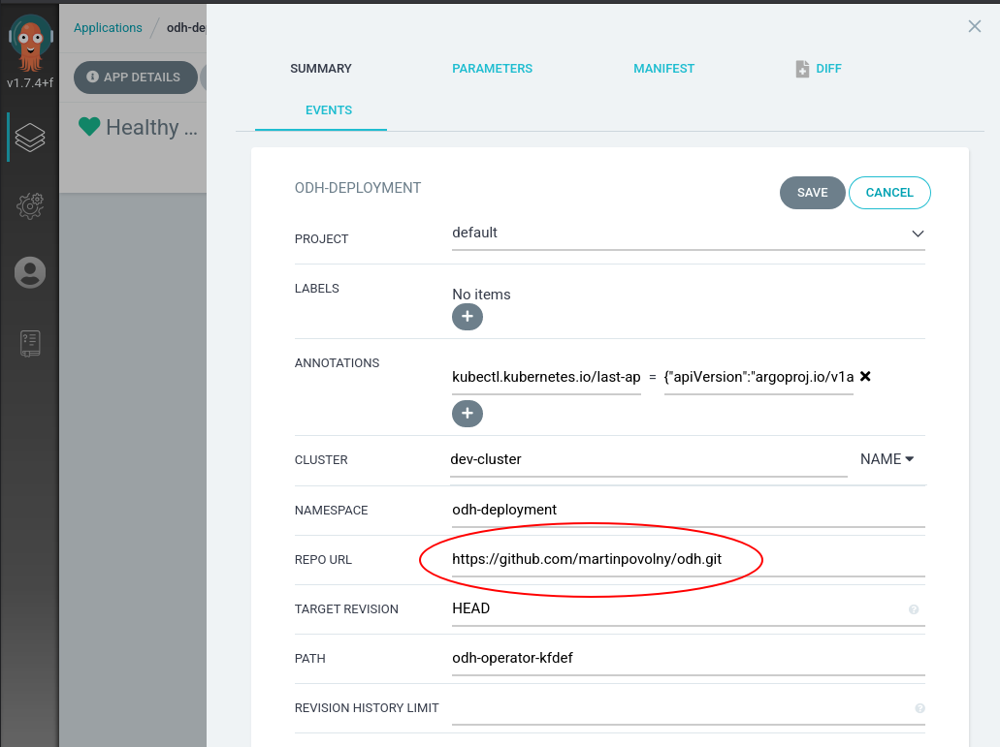

# Modify your ODH deployment

Below are the steps to modify your ODH deployment. Add components, content or anything else.

## Fork repo

Fork the repo https://github.com/operate-first/odh on GitHub.

## Replace repo reference in the ArgoCD app

Modify your `odh-deployment` Application resource in ArgoCD to point to your own fork.



## Use GIT to modify your deployment

Clone, edit, ... use your favourite tools to work with your fork of the repo.

Follow the documentation in ODH -- https://github.com/opendatahub-io/odh-manifests/.

For example to add Prometheus to your deployment of ODH do these changes:

```diff
diff --git a/odh-operator-kfdef/kfdef.yaml b/odh-operator-kfdef/kfdef.yaml
index c1de789..65dbcba 100644
--- a/odh-operator-kfdef/kfdef.yaml
+++ b/odh-operator-kfdef/kfdef.yaml
@@ -36,6 +36,22 @@ spec:
           name: manifests
           path: jupyterhub/notebook-images
       name: notebook-images
+    - kustomizeConfig:
+        parameters:
+        - name: namespace
+          value: odh-deployment
+        repoRef:
+          name: manifests
+          path: prometheus/cluster
+      name: prometheus-cluster
+    - kustomizeConfig:
+        parameters:
+        - name: namespace
+          value: odh-deployment
+        repoRef:
+          name: manifests
+          path: prometheus/operator
+      name: prometheus-operator
   repos:
     - name: manifests
       uri: 'https://github.com/opendatahub-io/odh-manifests/tarball/v0.8.0'

```

ArgoCD will synchronize the changes automatically or you can use the "Synchronize" button, based on the settings of the `odh-deployment` Application.
